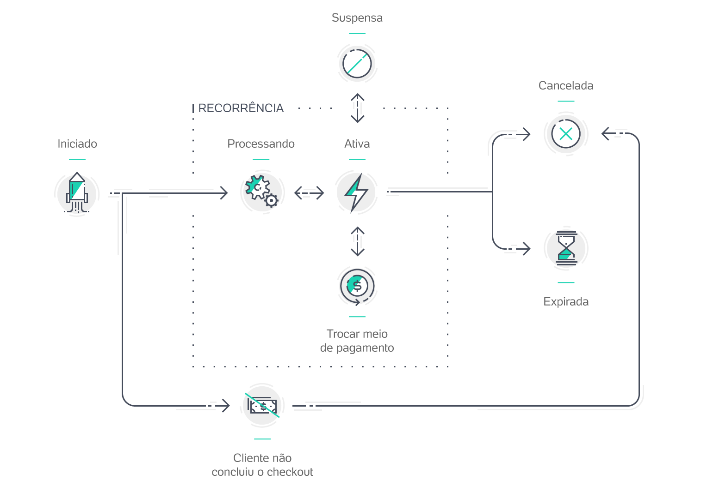

<h1 align="center">Welcome to pagseguro-that-works 👋</h1>
<p>
  
  <a href="https://github.com/EduSantosBrito/pagseguro-that-works#readme" target="_blank">
    
  </a>
  <a href="https://github.com/EduSantosBrito/pagseguro-that-works/graphs/commit-activity" target="_blank">
    
  </a>
  <a href="https://github.com/EduSantosBrito/pagseguro-that-works/blob/master/LICENSE" target="_blank">
    
  </a>
</p>

> Pagseguro API wrapper that actually works!

### 🏠 [Homepage](https://github.com/EduSantosBrito/pagseguro-that-works#readme)

The main problem that I want to resolve with this package is that PagSeguro API packages are confusing and bad documented, so I've created this to include every payment method I need to use.

Feel free to contribute :)

### 🔂 [Recurring Payment Flow](https://dev.pagseguro.uol.com.br/reference/api-recorrencia#recorrencia-introducao)

This feature will make this flow:



The basic flow is accomplished when these features are englobed:

| Description           | Developed | Tested |
| --------------------- | --------- | ------ |
| Plan creation         | Yes       | Yes    |
| Log in to join a plan | Yes       | Yes    |
| Plan adherence        | Yes       | Yes    |
| Billing plan          | Yes       | Yes    |
| Retry payment         | Yes       | Yes    |

The fully flow is accomplished when these features are englobed:

| Description               | Developed | Tested |
| ------------------------- | --------- | ------ |
| Plan creation             | Yes       | Yes    |
| Log in to join a plan     | Yes       | Yes    |
| Plan adherence            | Yes       | Yes    |
| Billing plan              | Yes       | Yes    |
| Suspend plan              | No        | No     |
| Reactivate plan           | No        | No     |
| Edit plan                 | No        | No     |
| Include coupon to payment | No        | No     |
| Change payment method     | No        | No     |
| Retry payment             | Yes       | Yes    |

## Install

```sh
yarn add pagseguro-that-works
```

## Test

> PS: You need to create a project running with PagSeguroDirectPayment at port 3000. If you want to clone something already developed, clone this repo: [pagseguro-hash-generator](https://github.com/EduSantosBrito/pagseguro-hash-generator)

> PS2: Create a .env based on .env.example

```sh
yarn test
```

## Author

👤 **Eduardo Santos Brito**

-   Website: https://portfolio.brito.top
-   Github: [@EduSantosBrito](https://github.com/EduSantosBrito)

## 🤝 Contributing

Contributions, issues and feature requests are welcome!<br />Feel free to check [issues page](https://github.com/EduSantosBrito/pagseguro-that-works/issues).

## Show your support

Give a ⭐️ if this project helped you!

## 📝 License

Copyright © 2021 [Eduardo Santos Brito](https://github.com/EduSantosBrito).<br />
This project is [MIT](https://github.com/EduSantosBrito/pagseguro-that-works/blob/master/LICENSE) licensed.

---

_This README was generated with ❤️ by [readme-md-generator](https://github.com/kefranabg/readme-md-generator)_
